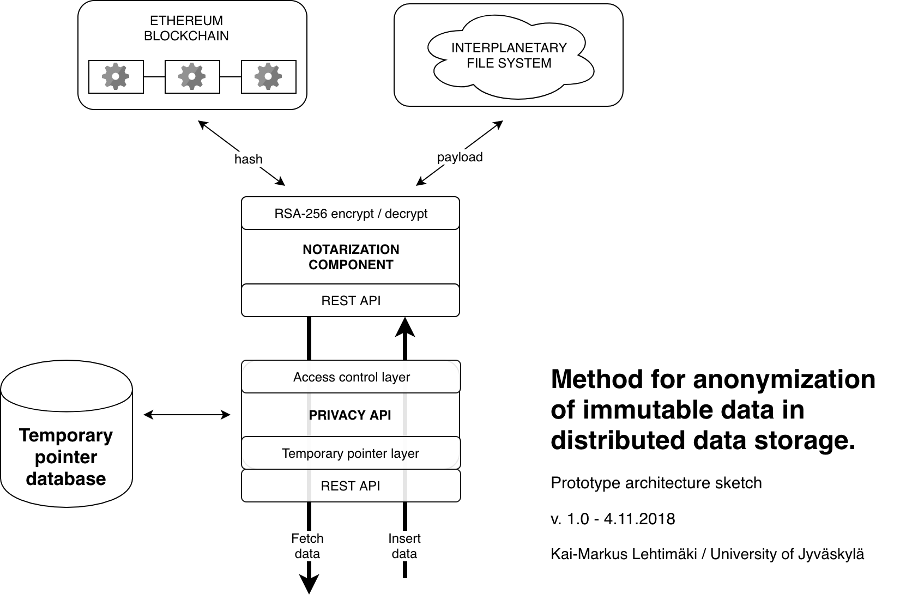

# notarization-component

Notarization component is software used to notarize text or files in distributed and immutable fashion. It exposes RESTful api for which takes multipart/form-data and stores it to IPFS and saves the hash of the file to smart contract residing in Ethereum blockchain.

## OAPI Specification

OpenAPI / Swagger specifications of this REST API can be found in root of this repository (`swagger.yaml`). These specification can be viewed locally using Swagger plugin or via online editor: `https://editor.swagger.io/`.

## Environment

This program uses environmental variables for configurations in production. Out of box software works in development mode. In development mode preset enviroment is used.

When deploying to production, following enviromental variables must be set;

```env
NOTARIZATION_PORT=[port to listen to]
GETH=[ip:port for ethereum node]
EXPIRATION_TIME=[time to host fetched and decrypted files in seconds]
ENCRYPT_KEY=[key string for file encrypt]
```

## NPM scripts

```bash
npm start - Starts the application with nodemon hotreload and babel
npm run build - Build application for production use
npm run serve - Start the production application
```

## Smart contract setup for development enviroment

Follow this procedure to migrate smart contracts for development environment

1. Go to smart_contract folder
   `cd smart_contract/`
2. Start truffle - This step launches local Ethereum instance
   `truffle develop`
3. In the truffle console, compile the smart contract (creates a build/ folder)
   `compile`
4. In the truffle console, migrate the smart contract to the current instance
   `migrate`

Now you have started a local Ethereum blockchain instance, and other applications can interact with smart contracts migrated to local blockchain instance.

## Encryption

All the files are hosted in IPFS, but as the files are available for everyone with the correct hash, we need to encrypt the files before uploading them. When the file is being fetched back, it'll be decrypted back to it's original form. These files are in public/ folder. In production, these files are removed after expiration time.
